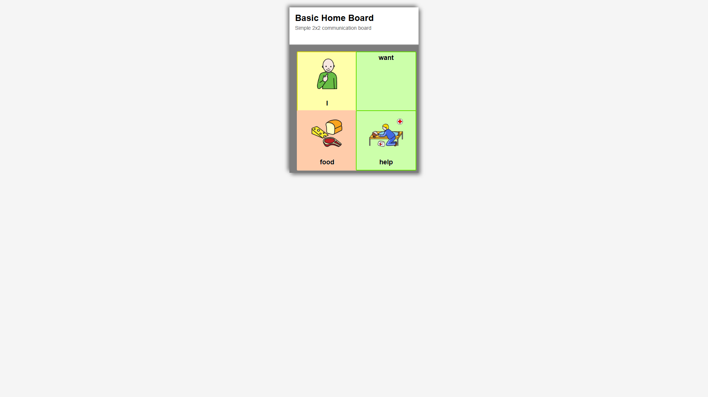
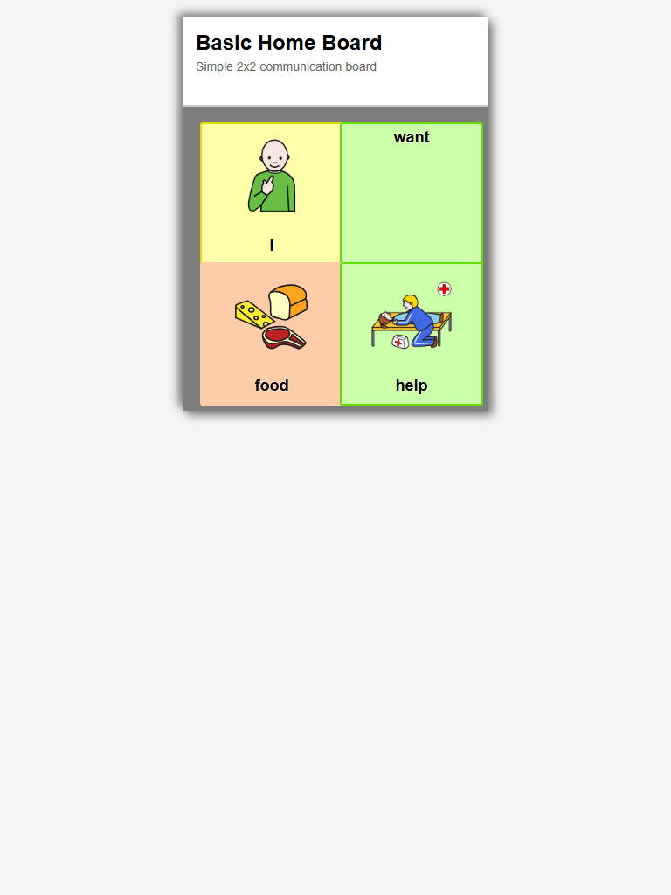
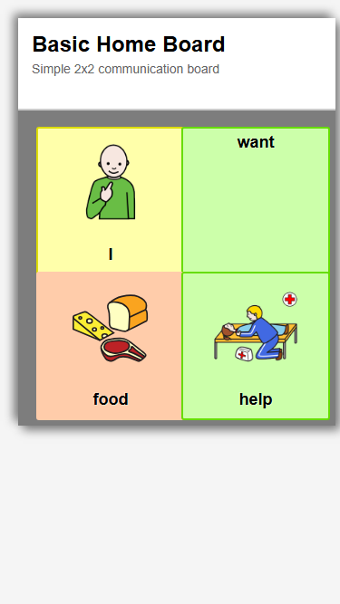
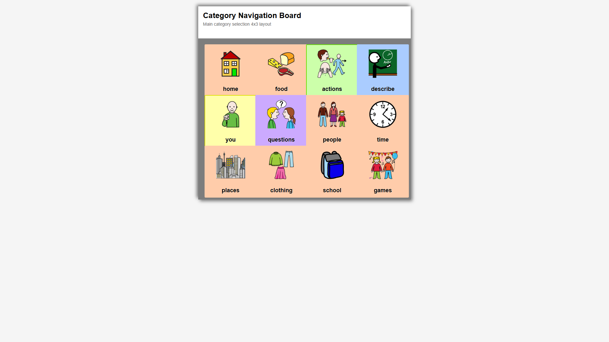
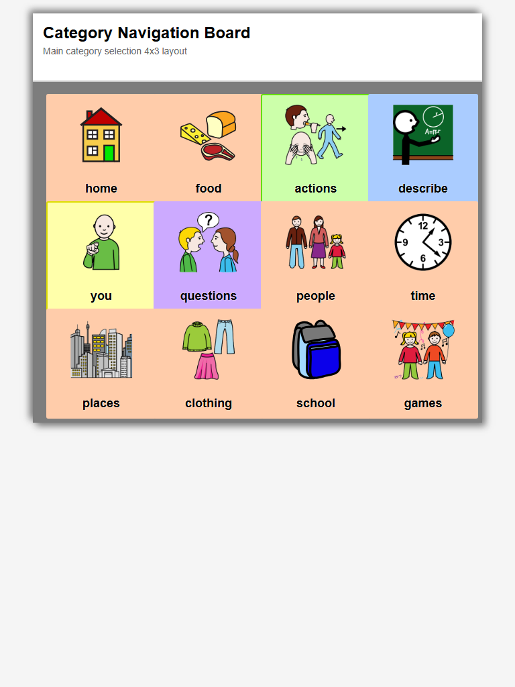
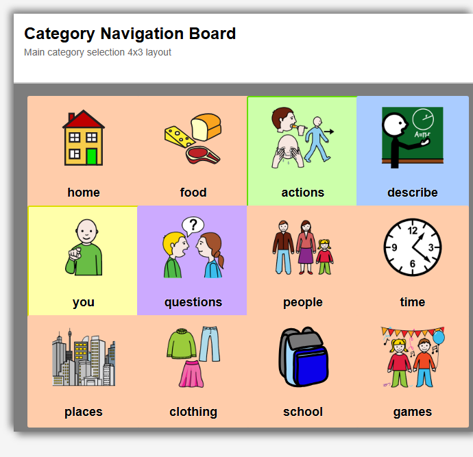
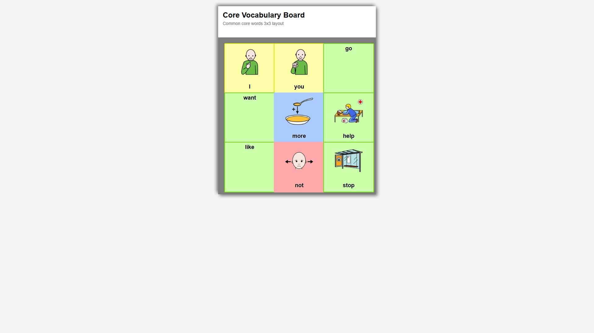
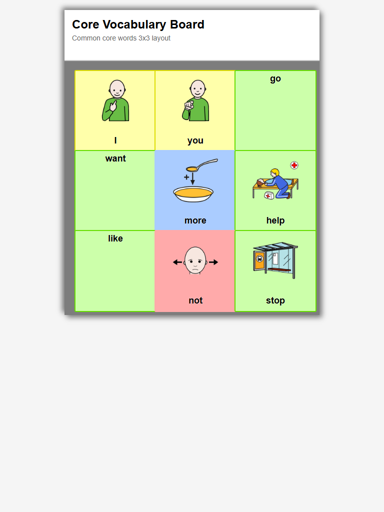
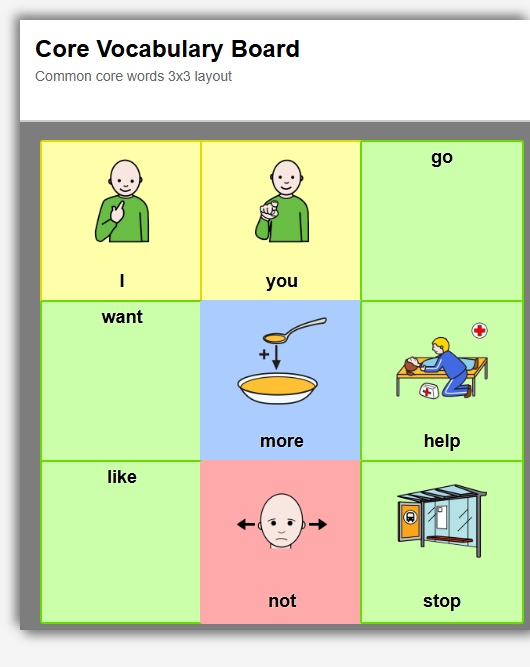
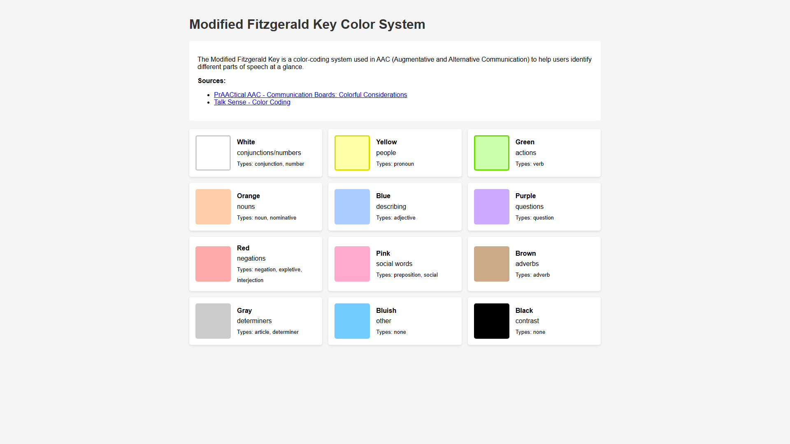

# LingoLinq AAC Screenshot Capture Report

Generated: 2025-09-30T22:56:41.992Z

## Summary

- **Total Screenshots**: 10
- **Output Directory**: `C:\Users\skawa\LingoLinq-AAC\.ai\visual-specs\screenshots`

## Captured Boards

### basic_home

- **desktop** (1920x1080): `basic_home_desktop.png`
  

- **tablet** (768x1024): `basic_home_tablet.png`
  

- **mobile** (375x667): `basic_home_mobile.png`
  

### categories_board

- **desktop** (1920x1080): `categories_board_desktop.png`
  

- **tablet** (768x1024): `categories_board_tablet.png`
  

- **mobile** (375x667): `categories_board_mobile.png`
  

### core_vocabulary

- **desktop** (1920x1080): `core_vocabulary_desktop.png`
  

- **tablet** (768x1024): `core_vocabulary_tablet.png`
  

- **mobile** (375x667): `core_vocabulary_mobile.png`
  

### color-reference

- **desktop** (1920x1080): `color-reference.png`
  

## Usage

These screenshots represent the current state of LingoLinq AAC communication boards:

1. **Baseline Reference**: Use these as the "before" state for modernization planning
2. **Color System**: The Modified Fitzgerald Key color-coding is accurately represented
3. **Symbol Library**: OpenSymbols.org images show the actual visual style
4. **Layout Examples**: Grid layouts demonstrate spacing and button sizing

## Next Steps

- Compare with modern AAC app designs
- Create mockups for modernized UI
- Plan incremental visual updates
- Test accessibility improvements
